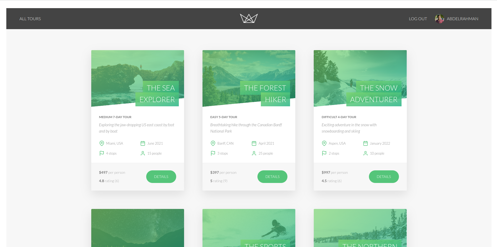
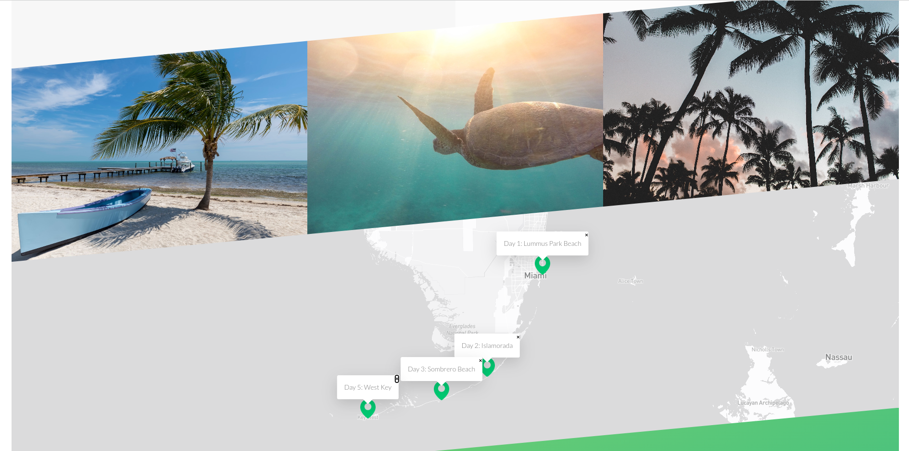
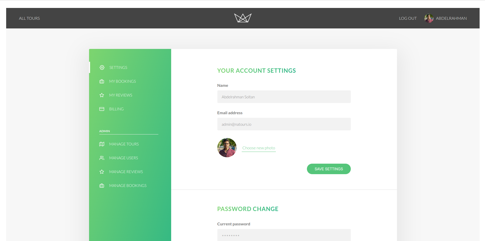

# Natours

<div id="top"></div>


<!-- PROJECT LOGO -->
<div align="center">
<br>
<a href="https://natours-abdelrahman-soltan.up.railway.app/">
    
  </a>
<br>
<br>

  <p align="center">
  <a href="https://natours-abdelrahman-soltan.up.railway.app/">View Demo</a>
    ·
    <a href="https://github.com/abdrahmansoltan/Natours/issues">Report Bug</a>
  </p>
</div>

<!-- TABLE OF CONTENTS -->
<details>
  <summary>Table of Contents</summary>
  <ol>
    <li>
      <a href="#about-the-project">About The Project</a>
      <ul>
        <li><a href="#features">Features</a></li>
        <li><a href="#built-with">Built With</a></li>
        <li><a href="#users">Users</a></li>
      </ul>
    </li>
    <li>
      <a href="#getting-started">Getting Started</a>
      <ul>
        <li><a href="#installation">Installation</a></li>
        <li><a href="#ports-and-endpoints">Ports and EndPoints</a></li>
      </ul>
    </li>
    <li><a href="#contributing">Contributing</a></li>
  </ol>
</details>

<!-- ABOUT THE PROJECT -->

## About The Project

Natours is a tours booking website, where users can browse tours, book tours, and pay for them using stripe payment gateway. It's a full-stack project, built using the Node.js.






### Features

- Login / Sign-up
- Edit user-data
- Add jobs
- Browse user's jobs with (search + filter) feature
- Display jobs-status + monthly-applications in graphs

### Built With

- Node.js
- Express
- MongoDB & Mongoose
- PUG
- Babel & Parcel
- Railway (for deployment)

### users

| Email              | Password |
| ------------------ | -------- |
| loulou@example.com | test1234 |
| leo@example.com    | test1234 |
| eliana@example.com | test1234 |

#### Validation

- **Email validation**: as per **RFC2822** standards.
- **Password validation**:
  - The password must be more than **8** characters.

<p align="right">(<a href="#top">back to top</a>)</p>

---

<!-- GETTING STARTED -->

## Getting Started

This project require some perquisites and dependencies to be installed, you can find the instructions below

This project require some perquisites and dependencies to be installed, you can view it online using this [demo](https://natours-abdelrahman-soltan.up.railway.app/). or you can find the instructions below:

> To get a local copy, follow these simple steps :

### Installation

#### installing Locally

1. Clone the repo

   ```sh
   git clone https://github.com/abdrahmansoltan/Natours.git
   ```

2. go to project folder

   ```sh
   cd Natours
   ```

3. install dependencies

   ```sh
   npm install
   ```

4. Environmental Variables Set up

   - Here are the environmental variables that needs to be set in the **`config.env`** file in the main directory.
   - These are the default setting that I used for development, but you can change it to what works for you.

   ```
    JWT_SECRET=<any secret value of your choice>
    NODE_ENV=development
    PORT=3000
    DATABASE=<Your mongodb database url>
    USERNAME=<Your mongodb database username>
    DATABASE_PASSWORD=<Your mongodb database password>
    JWT_SECRET=<any secret value of your choice>
    JWT_EXPIRES_IN=90d
    JWT_COOKIE_EXPIRES_IN=90
    EMAIL_HOST=sandbox.smtp.mailtrap.io
    EMAIL_PORT=2525
    EMAIL_USERNAME=<Your mailtrap username>
    EMAIL_PASSWORD=<Your mailtrap password>
    EMAIL_FROM=<Your sender email>
    STRIPE_SECRET_KEY=<Your stripe secret key>
   ```

   - **Note:** You should also replace the (stripe publishable key) with your own publishable key in the [public/js/stripe.js](public/js/stripe.js) file.

5. Run development server

   ```sh
   npm run watch:js & npm run dev
   ```

---

### Ports and EndPoints

#### Ports

- BackEnd Development Server runs on port `3000`

#### API endpoints

**Main UI URL**: [http://127.0.0.1:3000](http://127.0.0.1:3000)
**Main API URL**: [http://127.0.0.1:3000/api/v1](http://127.0.0.1:3000/api/v1)

- **Auth**

  - Register User: [http://localhost:5000/api/v1/auth/register](http://localhost:5000/api/v1/auth/register) [POST]
  - Register User: [http://localhost:5000/api/v1/auth/login](http://localhost:5000/api/v1/auth/login) [POST]
  - Update User: [http://localhost:5000/api/v1/auth/updateUser](http://localhost:5000/api/v1/auth/updateUser) [PATCH]

- **Jobs**

  - Get all jobs: [http://localhost:5000/api/v1/jobs?status=all&jobType=all&page=1](http://localhost:5000/api/v1/jobs?status=all&jobType=all&page=1) [GET]
  - Create job: [http://localhost:5000/api/v1/jobs](http://localhost:5000/api/v1/jobs) [POST]
  - Update job: [http://localhost:5000/api/v1/jobs/:id](http://localhost:5000/api/v1/jobs/:id) [PATCH]
  - Delete job: [http://localhost:5000/api/v1/jobs/:id](http://localhost:5000/api/v1/jobs/:id) [DELETE]
  - Get stats: [http://localhost:5000/api/v1/jobs/stats](http://localhost:5000/api/v1/jobs/stats) [Get]

#### Postman Collection and documentation

[Natours API Documentation](https://documenter.getpostman.com/view/20414422/2s93K1oz6Z)

- You can find the postman collection for this project by click in this button to fork the natours collection
  [](https://app.getpostman.com/run-collection/20414422-8a51a987-41e6-484b-8d33-da240a8ab26e?action=collection%2Ffork&collection-url=entityId%3D20414422-8a51a987-41e6-484b-8d33-da240a8ab26e%26entityType%3Dcollection%26workspaceId%3Dea5c3aa4-1f27-4143-950f-21889e774644#?env%5BDev%5D=W3sia2V5IjoiVVJMIiwidmFsdWUiOiJodHRwOi8vMTI3LjAuMC4xOjMwMDAiLCJlbmFibGVkIjp0cnVlLCJ0eXBlIjoiZGVmYXVsdCIsInNlc3Npb25WYWx1ZSI6Imh0dHA6Ly8xMjcuMC4wLjE6MzAwMCIsInNlc3Npb25JbmRleCI6MH0seyJrZXkiOiJwYXNzd29yZCIsInZhbHVlIjoidGVzdDEyMzQiLCJlbmFibGVkIjp0cnVlLCJ0eXBlIjoiZGVmYXVsdCIsInNlc3Npb25WYWx1ZSI6InRlc3QxMjM0Iiwic2Vzc2lvbkluZGV4IjoxfV0=)
- Postman environment variables:

  ```
  URL=http://127.0.0.1:3000
  password=test1234
  ```

<p align="right">(<a href="#top">back to top</a>)</p>

---

<!-- CONTRIBUTING -->

## Contributing

Contributions are what make the open source community such an amazing place to learn, inspire, and create. Any contributions you make are **greatly appreciated**.

If you have a suggestion that would make this better, please fork the repo and create a pull request. You can also simply open an issue with the tag "enhancement".
Don't forget to give the project a star! Thanks again!

1. Fork the Project
2. Create your Feature Branch (`git checkout -b feature/AmazingFeature`)
3. Commit your Changes (`git commit -m 'Add some AmazingFeature'`)
4. Push to the Branch (`git push origin feature/AmazingFeature`)
5. Open a Pull Request

<p align="right">(<a href="#top">back to top</a>)</p>
